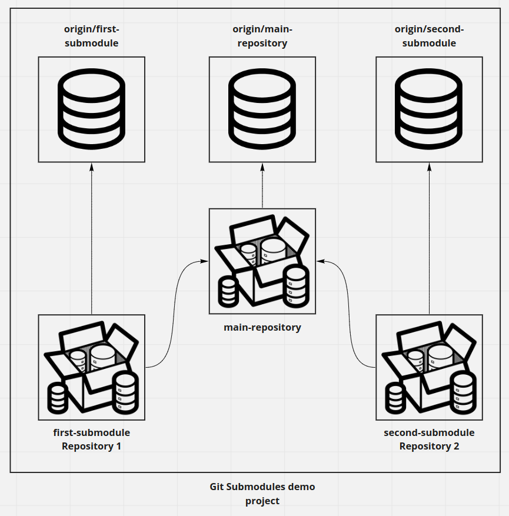

# Git Submodules demo

Given that we already have 2 existing repositories hosted on GitHub [first-submodule](https://github.com/montacerdk/first-submodule) and [second-submodule](https://github.com/montacerdk/second-submodule).
We would like to create a git-submodules-demo project that imports first-submodule and second-submodule projects as Git Submodules.



## Follow these steps to configure and setup your Git Submodules project

Create the main repository `git-submodules-demo` :

```
> mkdir git-submodules-demo
> cd git-submodule-demo/
> git init
```

Next we will add `first-submodule` and `second-submodule` to this fresh new repo :

```
> git submodule add https://github.com/montacerdk/first-submodule.git
  Cloning into '/home/montacer/projects/workshops/git-submodules-demo/first-submodule'...
  remote: Enumerating objects: 3, done.
  remote: Counting objects: 100% (3/3), done.
  remote: Compressing objects: 100% (2/2), done.
  remote: Total 3 (delta 0), reused 3 (delta 0), pack-reused 0
  Receiving objects: 100% (3/3), done.
> git submodule add https://github.com/montacerdk/second-submodule.git
  Cloning into '/home/montacer/projects/workshops/git-submodules-demo/second-submodule'...
  remote: Enumerating objects: 3, done.
  remote: Counting objects: 100% (3/3), done.
  remote: Compressing objects: 100% (2/2), done.
  remote: Total 3 (delta 0), reused 3 (delta 0), pack-reused 0
  Receiving objects: 100% (3/3), done.
```

Git will immediately clone the `first-submodule` and `second-submodule` repositories. We can now review the current state of the repository using git status :

```
> git status
On branch master
Changes to be committed:
  (use "git restore --staged <file>..." to unstage)
 new file:   .gitmodules
 new file:   first-submodule
 new file:   second-submodule
```

There are now 3 new untracked files in the main repository `.gitmodules`, `first-submodule` and `second-submodule` directory. Looking at the contents of `.gitmodules` shows the new Submodules mapping :

```
[submodule "first-submodule"]
 path = first-submodule
 url = https://github.com/montacerdk/first-submodule.git
[submodule "second-submodule"]
 path = second-submodule
 url = https://github.com/montacerdk/second-submodule.git
```

Now, you can commit changes on the main repository :

```
> git add .
> git commit -m 'Adding submodules to the main repository'
```

Once Submodules are properly initialized within the main repository, they can be utilized exactly like stand-alone repositories. This means that Submodules have their own branches and history. When making changes to a Submodule it is important to push Submodule changes.

Let’s and create some commits on `first-submodule` and verify the status of the main repository :

```
> git status
On branch master
Changes not staged for commit:
  (use "git add <file>..." to update what will be committed)
  (use "git restore <file>..." to discard changes in working directory)
 modified:   first-submodule (new commits)
no changes added to commit (use "git add" and/or "git commit -a")
```

Executing `git status` shows us that the main repository is aware of the new commits to the `first-submodule` but it doesn’t go into details, even if you run `git diff` on the main repository we can’t recognize what has changed :

```
> git diff
diff --git a/first-submodule b/first-submodule
index 1bd7ea6..33fa36e 160000
--- a/first-submodule
+++ b/first-submodule
@@ -1 +1 @@
-Subproject commit 1bd7ea66e729cce2c115e265521be828125a6f70
+Subproject commit 33fa36e538c801cdfc7776aeaddd45b2a63b43f6
```

Now, we can commit and push changes on both `first-submodule` and main repository and we are done!

## Utility commands

### Push parent repository and all its child repositories

```
git push --recurse-submodules=on-demand
```
