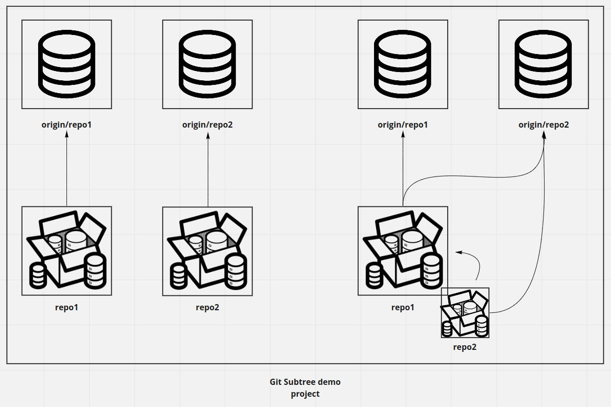
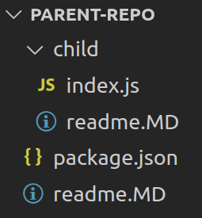
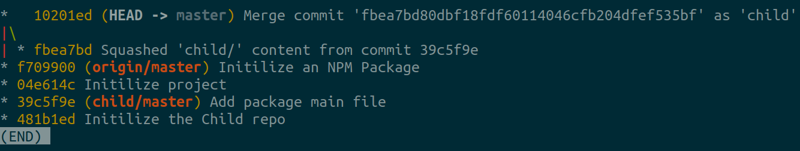

# Git Subtree demo



## Create the parent repository

In this demo, we will add a Subtree to a parent repository. We start first by linking our parent repository to GitHub after creating some commits :

```
~/parent-repo> git remote add origin https://github.com/montacerdk/parent-repository.git
~/parent-repo> git push -u origin master
```

## Create the parent repository

We also need to create our child repository that will be added as a Subtree to our parent repository. Also, create some commits and push them to GitHub :

```
~/child-repo> git remote add origin https://github.com/montacerdk/child-repo.git
~/child-repo> git push -u origin master
```

## Add the child Repository the parent as a Subtree

Now, let’s add the `child-repo` as a Subtree to our parent repository. To do so, we need to link the `child-repo` remote to our `parent-repo`. Then, we will execute the subtree command to clone the `child-repo` code into the `parent-repo` as a Subtree :

```
~/parent-repo> git remote add -f child https://github.com/montacerdk/child-repo.git
~/parent-repo> git subtree add --prefix child child master --squash
```

As a result, we will have the `child-repo` added as a directory to our `parent-repo`.



We can view the Git history on the `parent-repo` by running :

```
git log --all --decorate --oneline --graph
```

As we see in the next image, If we add `--squash` into the `git subtree add` command, Git will squash all the `child-repo`’s commit history into one commit on the `parent-repo`. Otherwise, it will display all the `child-repo`’s commit history.



## Push changes

Now using `git add`, `git commit` and `git push` commands, we can push changes to the `child-repo` to `origin/parent-repo`. But, in order to push them to the child remote, which is `origin/child-repo` on `child-repo`, we need to run this command :

```
~/parent-repo> git subtree push --prefix child child master
```

## Pull chagnes

First, start by adding some changes to the `child-repo` :

```
~/child-repo> git fetch origin -p
~/child-repo> git pull
~/child-repo> git add . && git commit -m 'Adding some files' && git push
```

Then we can pull these changes on the `parent-repo` by running this command :

```
~/parent-repo> git subtree pull --prefix=child child master --squash
```

If you added `--squash` when creating the Subtree, you will always need to add `--squash` when pulling, otherwise, pull will not pass.

## Switch branches

Create a new branch on the `child-repo`, make some changes and push them to `origin/child-repo` :

```
~/child-repo> git checkout -b release/1.0.0
~/child-repo> git add . && git commit -m 'Adding some changes for release' && git push
```

To switch to `release/1.0.0` branch on `parent-repo`, just delete child folder from history, commit and recreate the Subtree from the new `release/1.0.0` branch :

```
~/parent-repo> git rm -r child
~/parent-repo> git commit 'Switching to release/1.0.0 branch'
~/parent-repo> git subtree add --prefix child child release/1.0.0 --squash
```
